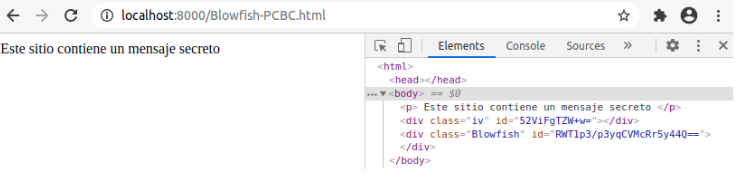
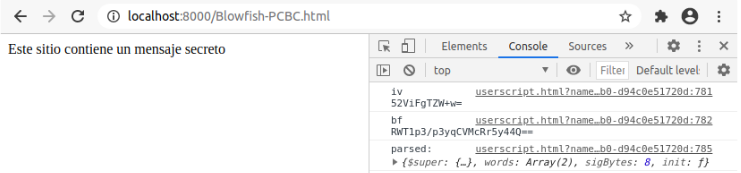

# Criptografía y seguridad en redes: Cifrado simétrico 

Se utiliza javascript para descifrar un mensaje cifrado con otro lenguaje. El objetivo de este trabajo es verificar la interoperabilidad de distintos lenguajes y de sus librerías criptográficas.

Según estadísticas recopiladas por el sitio Stack Overflow, los dos lenguajes que más proyecciones a futuro tienen son Python y Javascript, por lo que para la presente tarea se le solicita utilizar ambos lenguajes.

Por el lado del servidor, para la creación de sitios web, se crea un archivo html con Python, el cual contiene:

```
<p>Este sitio contiene un mensaje secreto</p>
<div class="algorithm" id="msg_cifrado"></div>
```

donde el contenido de id corresponde a un mensaje cifrado utilizando la librería de Python con el algoritmo de cifrado simetrico BlowFish. 

Desde el lado del cliente, a través de un plugin para Tampermonkey utilizando Javascript, se descifra el mensaje cifrado previamente, utilizando una configuración previamente acordada (parámetros como llave, semilla, rounds, etc. ) dependiendo los parámetros soportados por el algoritmo y por la implementación del algoritmo.

## Archivos

* Archivo Python: Encriptación Blowfish - PCBC y generador HTML.

```
import: Se importan librerías necesarias, entre ellas: Blowfish, base 64, time y os urandom.
ciper: Se crea un objeto Cipher con una key.
my_str: Texto plano a cifrar. El modo PCBC solo puede cifrar datos que sean (en longitud) múltiplos del tamaño del bloque. Es decir, len(iv)*n donde en este
caso, n = 2.
my_str_as_bytes: Representación en bytes de texto plano a cifrar.
iv: urandom(8) vector inicializador (Random bytes largo 8).Puede ser modificado directamente.
data_encrypted: variable que representará el texto cifrado.
Cipher.encrypt_pcbc(): Método de la clase Cipher. Inicializamos la función encriptar con los parámetros correspondientes.
token_iv: Vector inicializador decodificado desde utf-8 y codificado en base64 para lograr introducirlo en el archivo HTML.
token_dataencrypted: Texto encriptado decodificado desde utf-8 y codificado en base64 para lograr introducirlo en el archivo HTML.
html_str: String que corresponde al futuro archivo HTML.
html: Se reemplaza dentro del html_str el id por la representación en base 64 del vector inicializador.
time.sleep(1): Se utilizó para evitar problemas al intentar sobre-escribir.
Html1: Se reemplaza dentro del html_str el id por la representación en base 64 del texto encriptado por el algoritmo Blowfish.
Html_file: Se crea un archivo con extensión .html con los permisos para escribir en él.
Html_file.write(html1): Escribimos en el archivo.
```

<p align="center">

</p>

* Archivo JavaScript: Obtener parámetros desde HTML y desencriptar.

```
@match / @require: Apunta a un archivo JavaScript que se carga y ejecuta antes de que el script comience a ejecutarse. (Blowfish , Enc-base64, crypto-js , core-min).
var iv: Variable que representa el vector inicializador (b64) obtenido a partir del HTML.
console.log(): Mostramos por consola la variable deseada.
var bf: Variable que representa el texto encriptado (b64) obtenido a partir del HTML.
enc.Base64.parse(): Decodificar cadena desde Base64.
```

<p align="center">

</p>

## Blowfish

Blowfish es un cifrado de bloque simétrico que se puede utilizar como reemplazo directo de DES o IDEA. Se necesita una clave de longitud variable, desde 32 bits hasta 448 bits (4 a 56 Bytes), lo que la hace ideal tanto para uso doméstico como exportable. Blowfish fue diseñado en 1993 por Bruce Schneier como una alternativa rápida y gratuita a los algoritmos de cifrado existentes. Desde entonces se ha analizado considerablemente y poco a poco está ganando aceptación como un algoritmo de cifrado sólido. Blowfish no está patentado y no tiene licencia, y está disponible gratis para todos los usos.

### Modos de operación de una unidad de cifrado por bloques

En este caso, se trabajará con el Modo PCBC (_Propagating cipher-block chaining_).


PCBC es usado por Kerberos y Waste.

### IV: Vector de inicialización

Un IV es un bloque de bits que es utilizado por varios modos de operación para hacer aleatorio el proceso de encriptación y por lo tanto generar distintos textos cifrados incluso cuando el mismo texto claro es encriptado varias veces, sin la necesidad de regenerar la clave, ya que es un proceso lento.

El vector de inicialización tiene requerimientos de seguridad diferentes a los de la clave, por lo que el IV no necesita mantenerse secreto.
